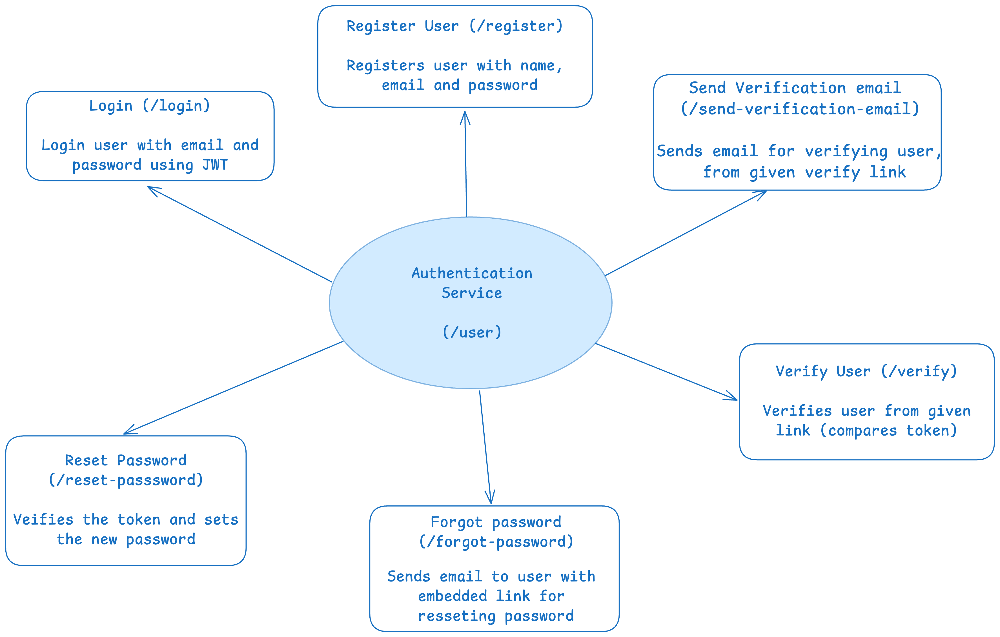
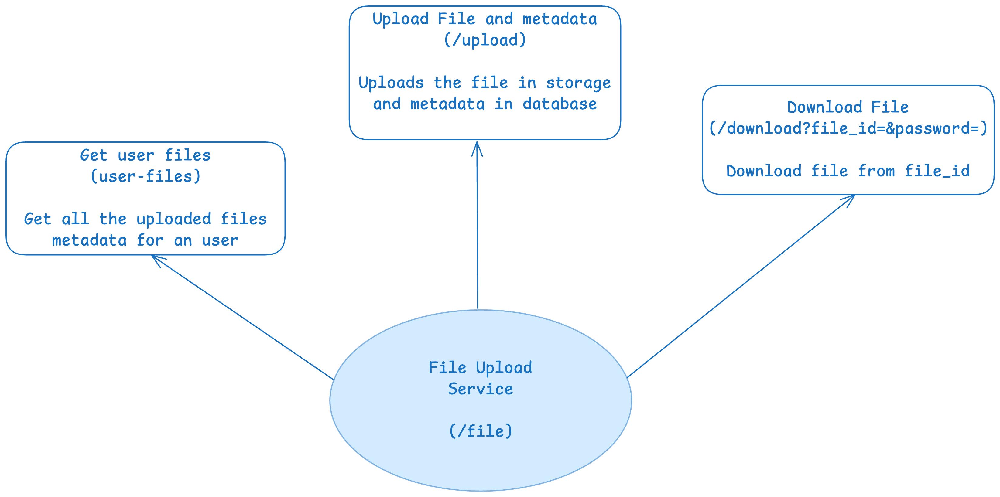

# 📁 fileshare-rs

**fileshare-rs** is a secure, end-to-end encrypted file sharing web service built with [Rust](https://www.rust-lang.org/) and [Axum](https://github.com/tokio-rs/axum). Inspired by services like Firefox Send (RIP) and WeTransfer, it allows users to upload files and share secure download links with optional password protection, expiry, and download limits.

> 🔐 Designed with security and simplicity in mind — easily self-hostable and privacy-focused.

---

## Overview

- [System Architecture](#🧠-system-architecture)
- [Security considerations](#🚨-security-considerations)
- [Features](#🚀-features)
- [Tech Stack](#⚙️-tech-stack)
- [Setup Locally](#🛠️-setup)
- [API Documentation](#📝-api-documentation)
- [Contact me](#👨‍💻-contact)

## 🧠 System Architecture




## 🚨 Security considerations

- If database got hacked, user credentials won't be exposed as it is being hashed before inserting in database.

- For files, if anyone somehow gets file_id for some file, it won't be possible for him to see the actual file as it's been encrypted before getting stored in cloud.

- User credentials are securely hashed before being stored in the database, so even if the database is compromised, the original passwords remain protected.

- Files are encrypted before being uploaded to the cloud. Therefore, even if an attacker obtains a valid `file_id`, they cannot access the actual content without the decryption key.

- The encryption keys are not stored alongside the encrypted files, reducing the risk of unauthorized decryption even if cloud storage is compromised.

- Access to sensitive endpoints (e.g., file upload, download, or user settings) should be gated behind proper authentication and authorization layers.

- Use HTTPS for all client-server communications to prevent man-in-the-middle attacks and ensure data-in-transit is encrypted.

## 🚀 Features

### 🔒 Authentication (JWT + Email Verification)

- User registration & login
- Secure password hashing (Argon2)
- Email verification workflow
- Password reset with email token

### 📤 File Upload

- Supports multipart/form-data for file uploads
- File size validation
- Metadata stored in MongoDB: filename, size, hash, etc.
- File content is encrypted and securely saved to Cloudinary storage.

### 🔗 Secure Download Links

- File download link generation
- Optional password protection (Argon2 hashed)
- Set max download count and expiry time
- Download request logging for tracking purposes

### 🧹 Expiry & Cleanup

- Time-based expiry checks
- Automatic deletion of expired files or after max downloads
- Background job and Cron cleanup support

---

## ⚙️ Tech Stack

| Layer      | Tech                                |
| ---------- | ----------------------------------- |
| Language   | Rust                                |
| Framework  | Axum                                |
| Database   | MongoDB                             |
| Storage    | Cloudinary                          |
| Auth       | JWT, Argon2, Sendgrid, Email Tokens |
| Background | Tokio + Cron Tasks                  |

---

## 🛠️ Setup

### Prerequisites

- [Rust](https://rustup.rs/)
- [MongoDB](https://www.mongodb.com/)

### Running Locally

```bash
# Clone the repo
git clone https://github.com/ap211unitech/fileshare-rs.git
cd fileshare-rs

# Create .env file
SERVER_URL=127.0.0.1:8000
MONGODB_URL=

SENDGRID_API_KEY=
SENDGRID_SENDER_NAME=fileshare-rs
SENDGRID_SENDER_EMAIL=

JWT_SECRET_KEY=my-jwt-secret-key

CLOUDINARY_CLOUD_NAME=
CLOUDINARY_API_KEY=
CLOUDINARY_API_SECRET=

# Run the server
cargo run
```

## 📝 API Documentation

This outlines the available routes and their respective functionalities for the fileshare-rs.

---

## 📦 User Routes

Base Path: `/user`

### `POST /register`

Registers a new user.

- **Description**: Accepts user credentials to create a new account.
- **Request Body**: JSON object containing user data (e.g., email, password).
- **Response**: Success message or validation errors.

---

### `POST /send-verification-email`

Sends an email with a verification link to the user.

- **Description**: Initiates the email verification process.
- **Request Body**: JSON with user email.
- **Response**: Email sent confirmation.

---

### `GET /verify?token=some_token&user=user_id`

Verifies the user's email.

- **Description**: Confirms the user account via verification token.
- **Query Parameters**: Includes the verification token and user id.
- **Response**: Success or failure message.

---

### `POST /login`

Authenticates a user.

- **Description**: Logs in the user and returns JWT token.
- **Request Body**: JSON with email and password.
- **Response**: JSON with authentication token or error message.

---

### `POST /forgot-password`

Sends a password reset link.

- **Description**: Triggers an email with instructions to reset the password.
- **Request Body**: JSON with user email.
- **Response**: Confirmation message.

---

### `PUT /reset-password?token=some_token&user=user_id`

Resets the user's password.

- **Description**: Uses a token to validate and update the password.
- **Query Parameters**: JSON with new password.
- **Response**: Password reset confirmation.

---

## 📁 File Routes

Base Path: `/file`

### 🔐 Protected Routes

> These routes require authentication via the `ExtractAuthAgent` middleware.

#### `POST /upload`

Uploads a file for the authenticated user.

- **Description**: Handles file uploads.
- **Request**: Multipart form data.
- **Headers**: `Authorization` token required.
- **Response**: Upload confirmation and file metadata.

---

#### `GET /user-files`

Lists all files uploaded by the authenticated user.

- **Description**: Fetches the authenticated user's files.
- **Headers**: `Authorization` token required.
- **Response**: JSON array of file metadata.

---

### 🌐 Public Routes

#### `POST /download`

Downloads a file.

- **Description**: Initiates file download. May require token or file identifier.
- **Request Body**: JSON with file ID or access token.
- **Response**: File stream or error message.

---

## ❤️ Health Check Route

Base Path: `/`

### `GET /`

Checks the server's health status.

- **Description**: Returns a simple status message to indicate the server is running.
- **Response**:
  ```json
  {
    "message": "Server is healthy!"
  }
  ```

## 👨‍💻 Contact

Have questions, suggestions, or want to collaborate? Feel free to reach out to the engineer behind this project:

**Name:** Arjun Porwal  
**Email:** porwalarjun95@gmail.com  
**GitHub:** [github.com/ap211unitech](https://github.com/ap211unitech)  
**LinkedIn:** [linkedin.com/in/arjun-porwal-9198b71a3/](https://linkedin.com/in/arjun-porwal-9198b71a3/)

I'm always open to feedback and discussions!
